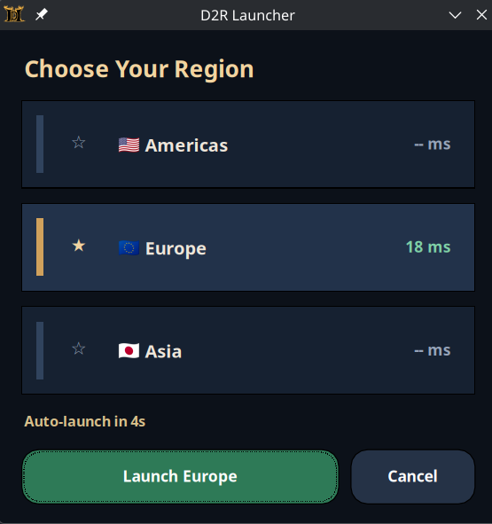

<h1 align="center">D2R Launcher</h1>

<p align="center">Small cross-platform launcher for Diablo II: Resurrected.</p>

<p align="center">
  
</p>

## Quick Start
1. Build or download the launcher.
2. For `direct` mode, place the launcher next to `D2R.exe` or set `d2r_path` in `config.json`.
3. Open the launcher and click a region to select it.
4. Double click a region or press `Launch` to start.
5. Click the star to save your favorite region.

## Local
```sh
cargo run
```

## Verify
```sh
cargo fmt
cargo test --locked
cargo clippy --all-targets --all-features --locked -- -D warnings
cargo build --locked --release
```

## Docs
- [Development](docs/DEVELOPMENT.md)
- [Release](docs/RELEASE.md)
- [Changelog](CHANGELOG.md)
